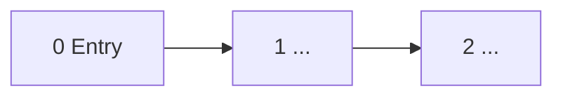
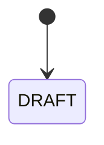

# SPEC — <feature>

> **Single source of truth for behaviour.** If a behaviour isn't here, it isn't defined — add it before building.
> Crypto, auth envelopes, exact third-party payloads → the partner API doc. This spec says *which* call and *what to do with the result*, never how to sign it.

| Owner | Status | Last updated |
|---|---|---|
| <pm> | Draft | <date + one-line change> |

**Contents:** 1 Overview · 2 Glossary · 3 Flow · 4 Screens in detail · 5 States · 6 Error matrix · 7 Edge-case register · 8 Data · 9 Background jobs

---

## 1. Overview
<What we're building, in 3 sentences. Who does what — actor/system table. Who owns the truth per topic.>

## 2. Glossary
<Read once; the rest reads easily. Every domain term, plain meaning. Include any gotcha in the term itself.>

## 3. Flow

<Resume rules, expiry rules, entry points. Then the all-screens-at-a-glance table: # · screen · purpose · input? · produces/next.>

## 4. Screens in detail

Field tables use: **Field · Type · Required · Values/format · Validation & error copy · Notes.** ⚠️ = open question (must have a row in DECISIONS.md).

### Screen N — <name>
Purpose: <one line>.

| Field | Type | Required | Values / format | Validation & error copy | Notes |
|---|---|---|---|---|---|
| | | | | "<exact copy the user sees>" | |

**Cross-field checks:** <rules that span fields>
**On continue:** <what persists, what fires — event names must exist in TRACKING.md>

> Every row here must FIRE in the prototype. If you can't demo the validation, it goes in the edge-case register as NOT-DEMONSTRABLE with a rationale — or you build it.

## 5. States

<State table: external status (verbatim strings if a partner API) → our state → action.>

## 6. Error matrix
**Auto** = silent retry · **Manual** = user acts · **Ops** = internal queue. Rules: every external call logged · no dead ends.

| ID | Scenario | What we do | Retry |
|---|---|---|---|
| E1 | | | |

## 7. Edge-case register
Every technical and user edge case, tied to a coverage-plan scenario ID (S#) from the manifest. **Demonstrable** = trigger steps reproduce it in the prototype. `NOT-DEMONSTRABLE` is allowed only for: (a) third-party-side behaviour, (b) long-horizon/time-based behaviour, (c) non-deterministic race conditions — and each still needs expected behaviour here, a reason in the manifest, and a named production test in HANDOFF.md. Anything else undemonstrable = wrong tier.

| Scenario | Case | Expected behaviour | Demonstrable? | How to trigger (or category a/b/c + production test if NOT-DEMONSTRABLE) |
|---|---|---|---|---|
| S1 | | | yes / NOT-DEMONSTRABLE | |

## 8. Data
<What we store vs. what the partner owns. Table: table name · holds (dev-relevant intent). Mark masked/never-stored fields.>

## 9. Background jobs

| Job | When | Does |
|---|---|---|
| | | |
